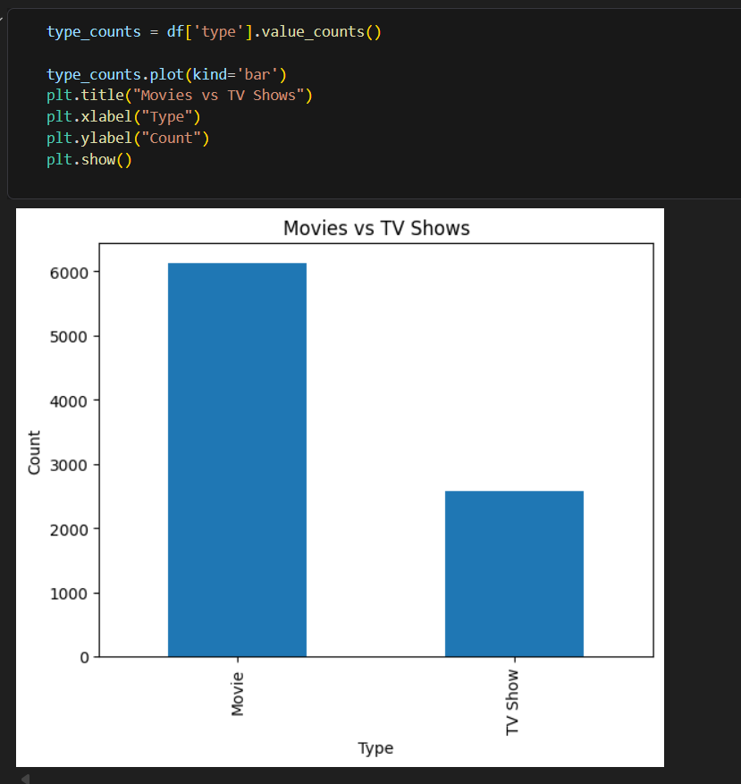
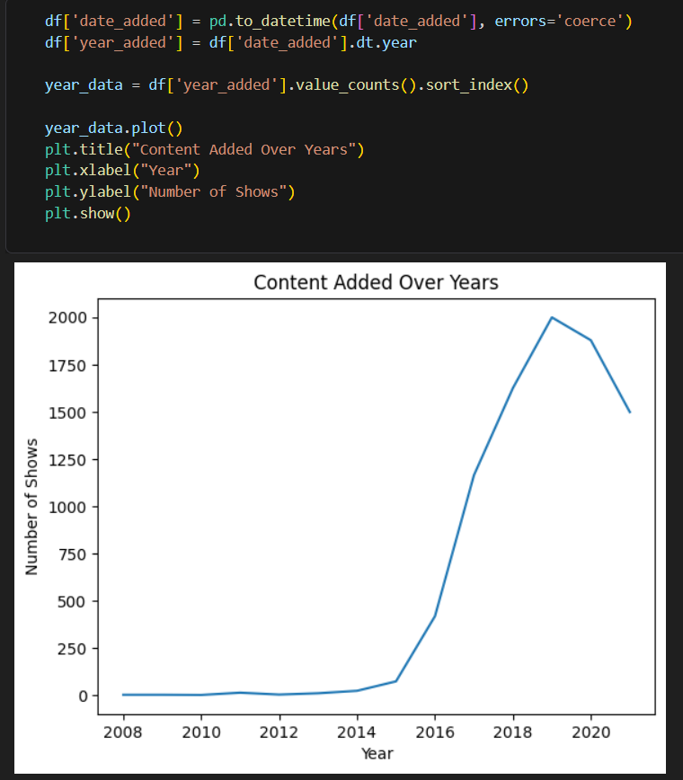
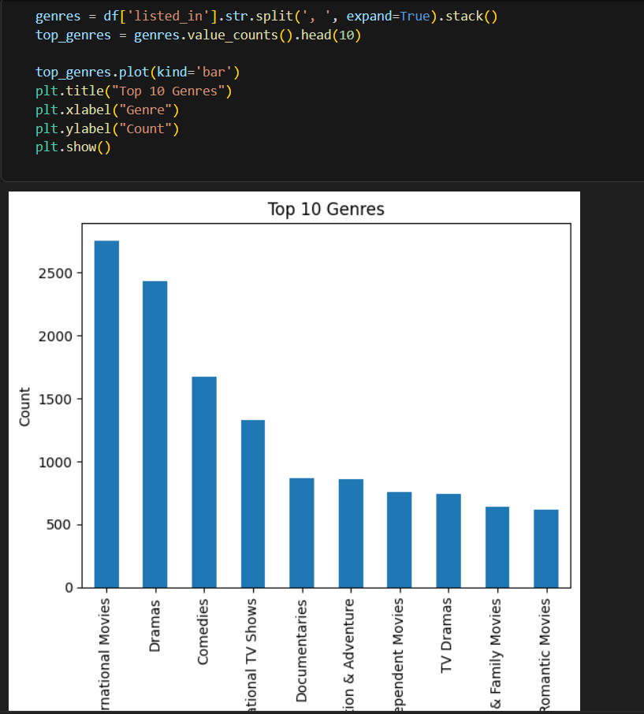

# 🎬 Netflix Data Analysis

## 📌 Objective
Analyze Netflix dataset to discover trends in movies, TV shows, genres, and countries.

## 🛠 Tools Used
- Python (Pandas, Matplotlib)
- SQL
- Jupyter Notebook

## 🔄 Process
- Data Cleaning (handled missing values, duplicates)
- Feature Engineering (duration extraction, genre splitting)
- Exploratory Data Analysis (EDA)
- Data Visualization

## 📊 Key Insights
- Movies dominate Netflix content
- USA produces the highest number of titles
- Content growth increased rapidly after 2015
- Drama is the most common genre

## 📸 Visualizations

### 📺 Movies vs TV Shows

### 📅 Content Added Over Years

### 🎭 Top Genres

